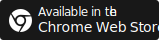

[Flutter Widget Livebook](](https://flutter-widget-livebook.blankapp.org)) is a website built with Flutter for web to live preview widget samples online.

> Now we created a Chrome extension. Let your flutter docs support live samples.

[](https://chrome.google.com/webstore/detail/flutter-widget-livebook/lnabimpogllgckbeoneoegflahpefomf)

### Examples

#### Card

```dart liveslice=Card
// See: https://flutter-widget-livebook.blankapp.org/widgets/Card/
```

#### AnimatedBuilder

```dart liveslice=AnimatedBuilder height=400px
// See: https://flutter-widget-livebook.blankapp.org/widgets/AnimatedBuilder/
```

#### AnimatedPhysicalModel

```dart liveslice=AnimatedPhysicalModel
// See: https://flutter-widget-livebook.blankapp.org/widgets/AnimatedPhysicalModel/
```

#### NestedScrollView

```dart liveslice=NestedScrollView mockup=iPhone7
// See: https://flutter-widget-livebook.blankapp.org/widgets/NestedScrollView/
```

### Stargazers over time

[](https://starchart.cc/blankapp/flutter-widget-livebook)
